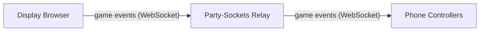
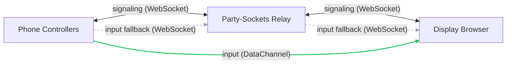

# Maze Party

A local-multiplayer maze party game — phones are the controllers, a shared screen is the game.

> **Early prototype.** The exact gameplay mechanics are still being figured out, so this README stays deliberately high-level. The networking, lobby, and rendering plumbing below is the stable part.

## Overview

Maze Party is a party game for 1 to 8 players on a single shared display. One browser window acts as the game screen (TV, monitor, or laptop), while each player joins by scanning a QR code with their phone, which becomes a swipe controller. Players navigate a procedurally generated maze on the shared screen. The display runs the authoritative game engine; the Node.js server only serves static files and a QR code API.

## Architecture

**Game events** — display broadcasts state to all controllers via the relay.



**Controller input** — after WebRTC negotiation, input goes directly to the display over a DataChannel; the relay serves as signaling channel and input fallback.



## Features

- 1–8 players on one shared screen
- QR code join – scan and play, no app install
- Swipe-to-steer touch controls with haptic feedback (Android)
- Procedurally generated maze, seeded for deterministic replay
- Color picker in lobby
- Controller settings: touch sounds, haptics
- Localized UI (11 languages)

## Quick Start

```bash
npm install
node server/index.js
```

1. Open `http://localhost:4000` on a big screen.
2. Players scan the QR code with their phones to join.
3. The first player to join is the host and starts the game.
4. Swipe on your phone to move through the maze.

## Project Structure

```
server/      # HTTP + static file server (index.js)
engine/      # Maze sim — isomorphic UMD, runs in the browser + Node tests
             #   maze-gen.js, maze-engine.js, constants.js
partyplug/   # Reusable party-game transport framework (room flow, relay, P2P)
public/
  display/   # Display client: game authority, Canvas maze renderer
  controller/# Phone touch controller (swipe-to-steer)
  shared/    # Protocol, colors, theme, i18n, shared UI
scripts/     # Relay load test (k6)
tests/       # Unit tests (node:test)
```

## Configuration

The display and controllers connect to a [Party-Sockets](https://github.com/tim4724/Party-Sockets) WebSocket relay for message forwarding. The relay URL is set in `public/shared/protocol.js`. If you run your own relay, update this value and the CSP `connect-src` directive in `server/index.js`.

| Environment Variable | Default | Description |
|---|---|---|
| `PORT` | `4000` | HTTP server port |
| `BASE_URL` | Auto-detected LAN IP | Base URL for join links and QR codes |
| `APP_ENV` | `development` | Set to `production` for production mode |
| `GIT_SHA` | – | Git commit SHA shown in version endpoint |

## Testing

```bash
# Unit tests
npm test

# Relay load test (k6 — requires k6 installed)
k6 run scripts/relay-loadtest.k6.js
```

Unit tests use Node.js's built-in `node:test` runner with `node:assert/strict` — no test framework dependency. They cover maze generation (`tests/maze-gen.test.js`), the maze simulation engine (`tests/maze-engine.test.js`), and the PartyPlug transport framework (`partyplug/tests/`). The relay load test models 5-client rooms (1 display + 4 controllers) against the configured relay URL; see the script header for environment knobs.

## Tech Stack

- **Runtime**: Node.js
- **Relay**: [Party-Sockets](https://github.com/tim4724/Party-Sockets) WebSocket relay (signaling + game events)
- **P2P**: WebRTC DataChannels for low-latency controller input
- **QR codes**: [qrcode](https://github.com/soldair/node-qrcode)
- **Frontend**: Vanilla JavaScript, Canvas API
- **Testing**: Node.js built-in test runner (`node:test`)
- **Production deps**: 1 npm package (`qrcode`)

No build step. No bundler. No framework. Serve and play.
